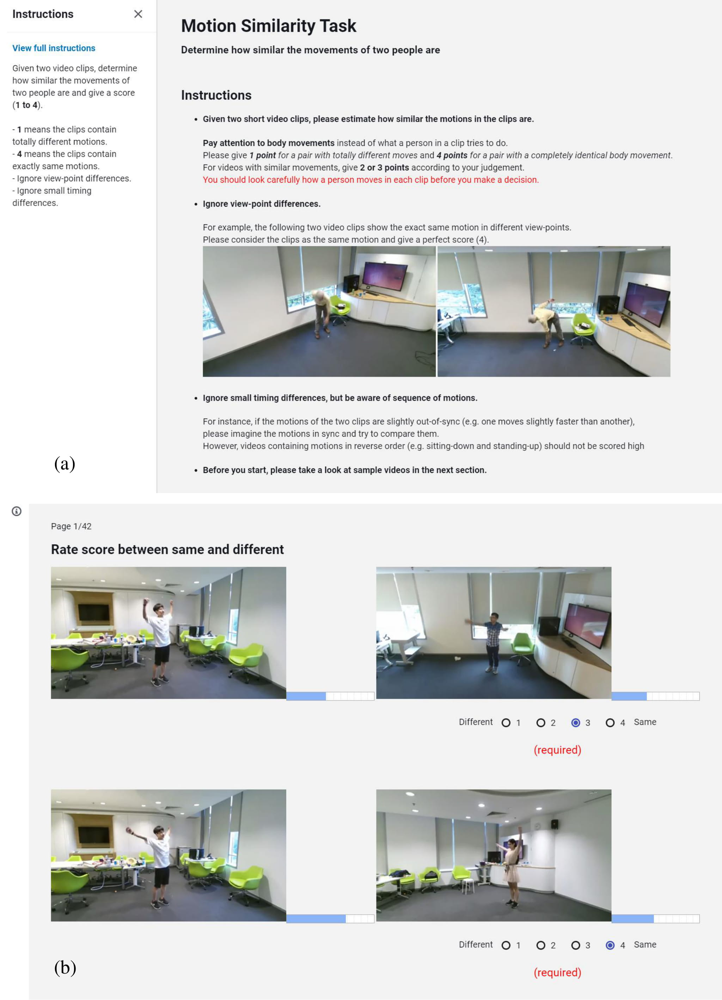
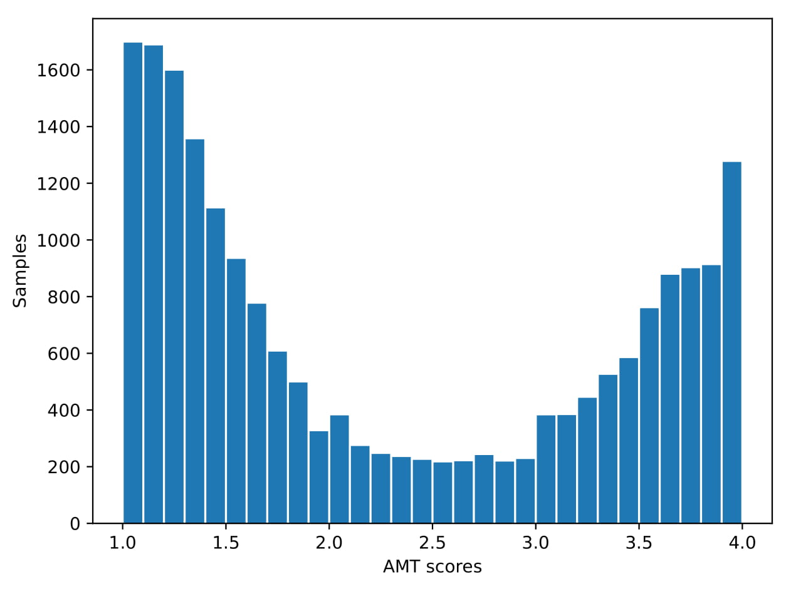
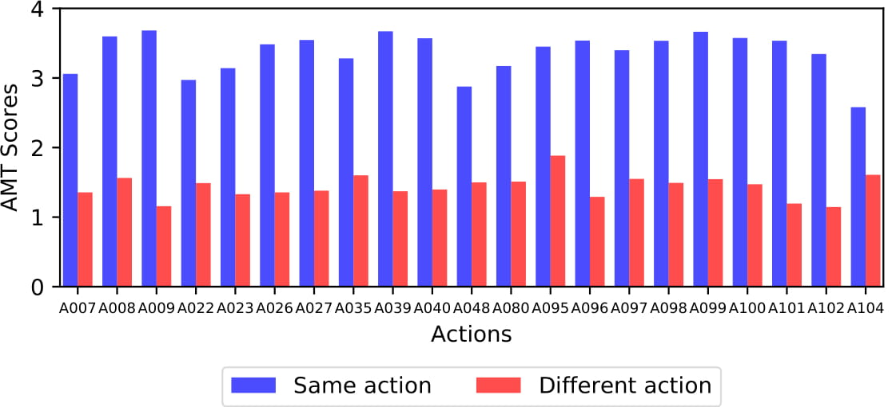
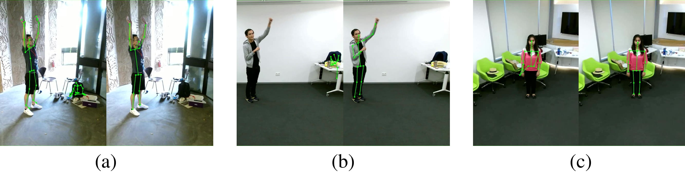

# NTU RGB+D motion similarity annotations
A motion similarity dataset with real-world videos to evaluate motion similarity.

The dataset using for model evaluation in the ECCV20 paper [_A Body Part Embedding Model With Datasets for Measuring Human Motion Similarity in 2D_](https://github.com/dade-ai/bpe-dev).

## Description
The annotations in this repository are generated on top of the [the NTU RGB+D 120 dataset](http://rose1.ntu.edu.sg/datasets/actionrecognition.asp). We have refined the dataset and adopted only a portion of the entire dataset. Specifically, we have removed the samples without skeletal annotations and then chose actions with large and precise movements. The RGB videos in the dataset are used to obtain the ground truth motion similarity from the AMT workers (as shown below): 

<p align="center">
  
</p>


### Score
The motion similarity is scored on a 4-point scale for one pair.

|Score  |Description                |
|------:|:-------------------------:|
|1      |utterly different motions  |
|2      |little similar             |
|3      |much similar               |
|4      |same movements             |

## Data statistics
We have collected 20093 pairs through AMT. The overall average similarity score of all pairs is 2.26. The average score of pairs with the same action category is 3.36, and with a different action category is 1.43.
### The histogram of the total collected scores.
<p align="center", width=10>
  
</p>

### The average similarity scores per action category.
The average scores for each action are depicted in figure.
The blue bar is the average score of the sample pairs composed of the same actions, and the red bar is the average score of all pairs in different actions.
<p align="center">
  
</p>

## Csv file example
|num	|sample1			    |sample2			    |AMT_score  |
|------:|:---------------------:|:---------------------:|:-------------:|
|1	    |S004C002P020R002A007	|S011C003P038R001A022	|1.4            |
|2	    |S007C001P015R002A027	|S024C001P064R001A099	|1.222          |
|3	    |S027C001P080R002A096	|S005C002P016R002A022	|1              |
|…	    |…				            |…				            |…              |
|20091	|S008C003P032R001A026	|S010C002P013R002A009	|1              |
|20092	|S027C001P084R002A100	|S003C001P002R001A027	|1.18           |
|20093	|S001C001P008R001A048	|S011C003P038R001A048	|3.27           |

## Data cleansing
We have noticed that some skeletal data of NTU RGB+D 120 is annotated imprecisely. 
Miss-annotated files can be classified into three cases.
1. The case where a skeleton representing human and a skeleton representing non-human objects are stored together, as shown on the left side of (a). In this case, the problem is that we cannot identify a correct human skeleton without looking at the original video.
2. The left side of (b) indicates that the skeleton is incorrectly located.
3. There are some cases where the joints have invalid annotations, as represented on the left side of (c).

To cope with these issues, we have used our reproduction ($AP^L=0.709$ on [COCO 2017](http://cocodataset.org/#download) valid set) of [MultiPoseNet](https://arxiv.org/abs/1807.04067) to generate new 2D joint annotations.

As a result, more accurate skeleton data is obtained and shown on the right side of (a), (b) and (c). The reproduced skeleton data is included as 'refined_skeleton.zip'.

<p align="center">
  
</p>

## Reproduced skeleton data
We also include a sample json file and a example python file. The json file format is similar to coco keypoint data format.

   ```   
    refined_skeleton dir (categorized by action number)
    |-- 007
        |-- S001C001P004R001A007.json
        |-- S001C001P005R002A007.json
        |-- ...
    |-- 008
        |-- S001C001P002R001A008.json            
        |-- ...
    |-- ...

   ```

## Contacts
Sukhyun Cho (chosh90@snu.ac.kr)

## Acknowledgments
- This work was supported by Kakao and Kakao Brain corporations.

- Portions of the research used [the NTU RGB+D 120 Action Recognition Dataset](http://rose1.ntu.edu.sg/datasets/actionrecognition.asp) made available by the ROSE Lab at the Nanyang Technological University, Singapore
